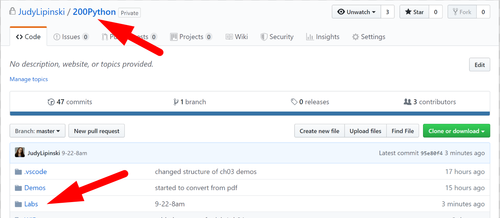
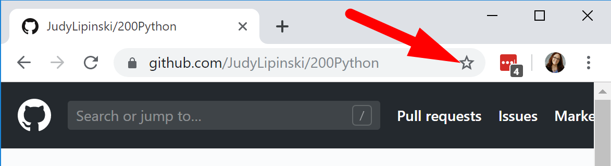
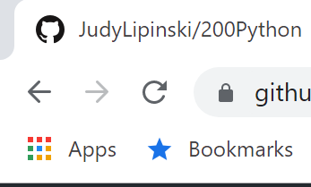
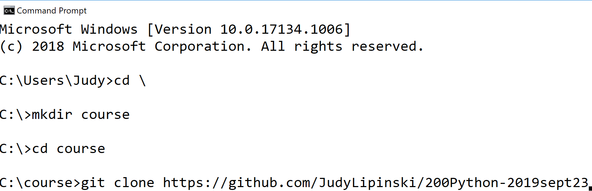
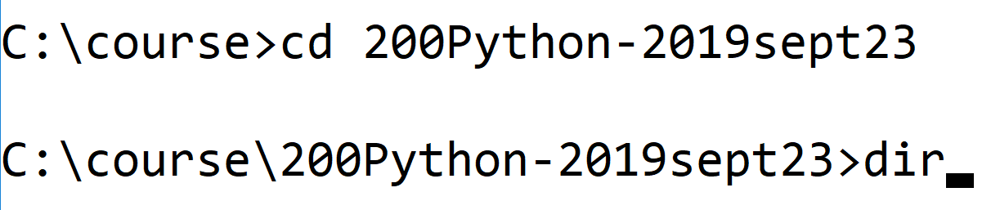

# Chapter 1: Use Git to get and explore the course files

## Objectives

* Practice with markdown files in GitHub
* Issue a git clone command to reference remote repo locally

## NOTES

* Throughout the course the terms folder and directory are used interchangeable.
* You may see references to Enter key and Return key. These are the same intention, Enter is usually found on Windows and Return on Macs.

## Links to content below

### Part 1 - Navigating the course on Github

1. Throughout the course you can use the browser to navigate to the course Git repository 200Python-XXXX (specific for your class). 

   

2. Bookmark this page for easier access later.  In Chrome can hit the star in the upper right hand side and choose Bookmarks bar. 
   
   
3. If you do not see the bookmarks bar, hit control+shift+B to make it appear.
   
   
4. Understanding the directories
    * The `/Labs` directory will be used for instructions and some source files to copy for the hands-on exercises you will be doing in class. 
    * The `/Demos` directory will be used for running demos.
    

    Reading the directions online in a browser is a good option if you have more than one monitor to use during class. In this case, you can keep the browser open in one monitor, while you code in the other.  

    If you are using a virtualized environment, you may wish to have your HOST machine with directions, and then the remote environment where you code.

### Part 2 - Obtaining the Course Files

   
1. Execute the commands shown here to create a new directory and clone the repository. 
   

2. This creates a new directory. From command prompt, cd into this directory and use dir to show the files.
   

   You should see the Demos and Labs folders.

1. Mark your work as complete. In class students typically use name tent cards, online students may be using status or spreadsheets.
     
## Bonus

1. If you are done before others, you can read through articles about working with Git.
   * https://confluence.atlassian.com/bitbucketserver/basic-git-commands-776639767.html
   * https://dzone.com/articles/top-20-git-commands-with-examples
  
      

