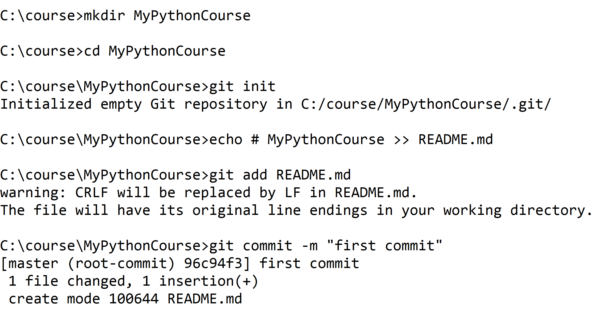

# Chapter 1: Create a new local git repo for your work

## Objectives

* Create new local repository MyPythonCourse to be used during class
* Commit changes
* Optionally create GitHub repository

## Links to content below

[Part 1 - Create Local Git Repo](#part-1---create-new-mypythoncourse-local-repository)

[Part 2 - Optionally create GitHub remote repo](#part-2-optional--setup-github-remote-repository)


### **Part 1 - Create new MyPythonCourse local repository**

    You will be creating a local repository in which to do your work in a folder called MyPythonCourse. It will be tracked by GIT so that if you accidentally delete or change files you can recover them easily. 

    Additionally, and optionally, you will be able to connect your local repository to a remote GitHub repository. 

1.  Open a command prompt to c:\

    When you commit locally, you need to have global configuration set to assign commit messages to your **name** and **email**.

    The name and email values do not need to match to real information. It is a good practice to match to the info you would use on a remote repository, such as  GitHub, but it is not required.

2. Execute these two commands, substituting your name and your email in the quotes. They are global commands and can be executed anywhere. 

    ```bat
        git config --global user.email "you@example.com"
        git config --global user.name "Your Name"
    ```

3. Execute these commands as follows. This will create a new folder called MyPythonCourse and place it under local source control. You may or may not see the warnings as pictured.
   



### **Part 2 OPTIONAL- Setup GitHub remote repository**

1. If you have access to GitHub you can follow the directions in this folder's file [optional-github.md](./optional-github.md)  file. If others are done with this exercise already you can return to do this on a break or at a later time. It can be completed at any time before the end of class.

