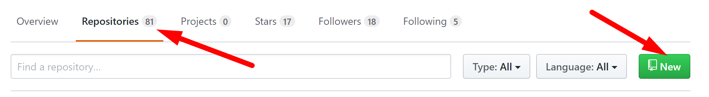
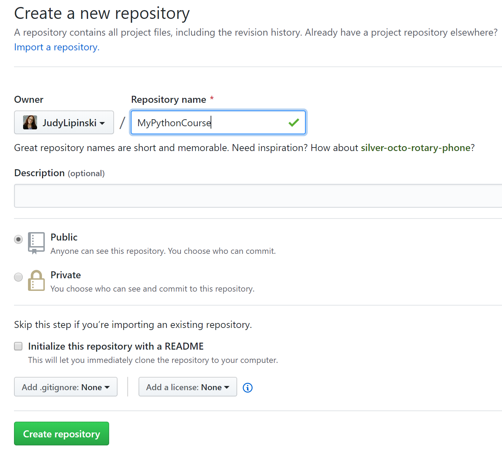
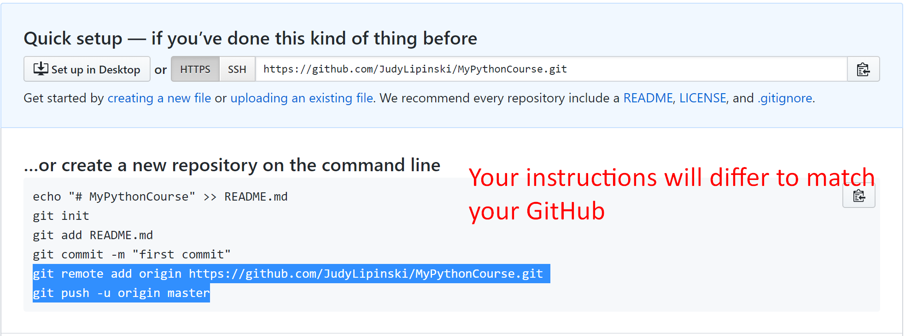
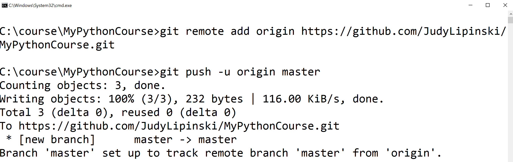

These instructions will help you to setup a remote repository in GitHub that you can push your code to.

### **Part 1 - Add a remote link from your local repo to GitHub**

1. Navigate to https://GitHub.com/ and sign into an existing account of yours or sign up for a new account.

2. After logging into GitHub, create a new GitHub repository called `MyPythonCourse` by clicking Repositories in the menu and the green new button.

    


3. In the menu that appears, choose public or private and skip the steps to initialize with a readme. 
      

    Leave the checkbox for `Initialize this repository with a README` unchecked and click the green button to `Create Repository`

4. You will be given instructions for the remote repo. You only need the last two lines. Yours will be slightly different than what is shown because it will be for your repo. Copy these lines and paste them into the command prompt in your MyPythonCourse directory.
 




4.  VS Code will continue to ask for your GitHub username and password every time it talks to GitHub. You can use a credential helper shown in the Windows example below:

    On Windows, running the following in the command line will store your credentials:

    ```
    git config --global credential.helper manager
    ```
