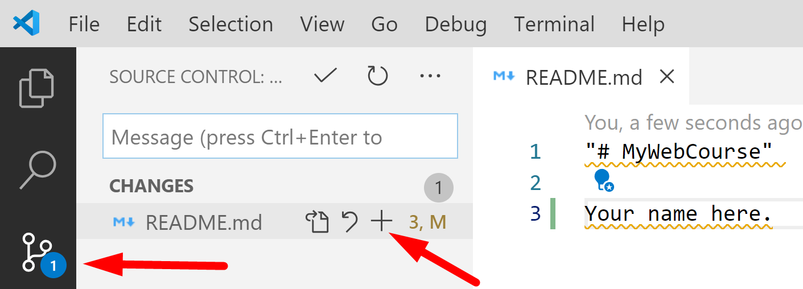

# Chapter 2:  Lab 2: More VS Code for Python

## Objectives
* Work with both the 200Python and MyPythonCourse projects
* Commit code from within VSCode
* Practice with Git within VSCode
  

### Table of Contents

[Part 1 - Opening Multiple Instances of VS Code](#part-1---opening-multiple-instances-of-vs-code)

[Part 2 - Using VS Code to commit changes](#part-2---using-vs-code-to-commit-changes)

[Part 3 - Use .gitignore to not track changes](#part-3---using-gitignore-to-ignore-changes)

[Part 4 - View GitLens extension](#part-4---view-gitlens)

[Bonus](#bonus)

### **Part 1 - Opening Multiple Instances of VS Code**

    Quite often you will need to have multiple instances of VS Code open.

    For example, you may be referring to a sample project and comparing to your own project. 
    
    In this class, you may wish to have open the Labs and your project.

    There are multiple options to do this including:
       * Running multiple instances of VS Code 
       * Putting projects in the same folder and opening that folder in VS Code
       * Creating a workspace 

    You can use control+c and control+v to copy and paste files and directories between projects.  

#### Multiple Instances, switch using Windows Task Bar

1. If Windows Explorer supports opening VS Code you can right click on the MyPythonCourse directory and choose Open in VS Code.   
   
   - OR -
   
   If Windows Explorer is not supporting VS Code, you can navigate to the `MyPythonCourse` directory in a command prompt and launch by execute the command `code .` to open the project in VS Code. 
   
   Using one of these methods, make sure you have two instances of VS Code running - one for 200Python and one for MyPythonCourse

2. You can use the windows status bar to switch between projects by clicking the icon and choosing the VS Code instance that you want. If you are not using a virtual machine which prevents you - you can use Alt+tab to switch.
   
   

   
   
3. Using VS Code, look in the same directory as this README.md and find the file **license-agreement.txt**.  Highlight this file and hit Control-C or right-click to choose copy.
   
4. In your MyPythonCourse project paste the file using Control-V or right-click and choosing paste.

   

### **Part 2 - Using VS Code to Commit Changes**

    By copying a file into your project, you might have noticed the source control icon now has a number on it. 
    
    Here we will practice with change tracking in projects.
   
1.  Delete the file license-agreement.txt. This will decrease the count of files being tracked.
   
2.  In your MyPythonCourse project, open the README.md file in Edit Mode by double clicking it.

3.  Add your name to the README.md file.

4.  Save the file, and notice the `Source Control` button on the left hand toolbar. The blue circle should now have the number 1. This number indicates the number of files that have been changed locally.

5.  Click on the Source Control button to open the panel `Source Control`. 
   
    In this panel, mouse over the README.md file; press the `+` button that appeared to stage the change. 

     
    
    You can also stage the change by right clicking on the README.md and clicking `Stage Changes`. 
    
    You should now see that `README.md` was added to `Staged Changes`
   

6.  Above `Staged Changes` you should see a text input field with the text `Message (press Ctrl+Enter to commit)`. Within this field enter a good commit message which describes the changes we staged in the previous step.

     

7.  Click the check mark above the text message field to commit the changes made to README.md

### **Part 3 - Using .gitignore to ignore Changes**

    Sometimes, you do not want Git to track certain files or directories.
    
    Git looks for a settings file called `.gitignore`. 
    Any files or directories included in this file will not be tracked.

1. Add a file called `.gitignore` to your MyPythonCourse project - notice there is an intentional period (.) proceeding the name of the file.

    You can add a new file in VS Code by using the Explorer pane add button.
    

2. Open the .gitignore file and add this on the first line: untracked.text
   
  
1. Now create a new file called `untracked.text` and inside add the text "This is a local file."
    * Save the file - and you should not see it being tracked by Git.
    * Also note the appearance of the file is a muted color

### **Part 4 - View GitLens** 
1.  On VS Code's left hand toolbar, click on the `GitLens` extension you installed earlier. This extension contains additional features.

    

2.  Familiarize yourself with `GitLens'` panel. 
    
   The different sections are accordion menus. Click to collapse these making what you want to look at easier to see.
   
   Notice how you can use it to access different repositories and their branches, etc. Also notice how you can navigate through it to see history of a file, a line, or compare files between different branches or between local and remote.

3.  Please mark your work as complete. With your name tent card if in a classroom or by using method for online training. (spreadsheet, status symbol, etc.) Then you can move on to the Bonus below.

## Bonus

1. Read more about Git in VS Code

https://code.visualstudio.com/docs/editor/versioncontrol

### **OPTIONAL - Push changes to GitHub**

    Now you can push your repo to GitHub. The changes you have committed locally will appear in GitHub.
   
    On projects with others involved, always PULL before you PUSH. 
    
1. Click on the `...` button found on top of VS Code's source control panel and choose **Push**.
   

   

2.  If you have not setup the credential manager, VS Code will prompt you to enter your GitHub credentials to push the changes. If you navigate to GitHub, you should see the README.md is updated with your changes.

3. To push commited changes, you can also click on the `Synchronize Changes` button found in blue on the bottom left of VS Code. This button will pull changes and then push commits made to the current branch we are on.    
   
   

